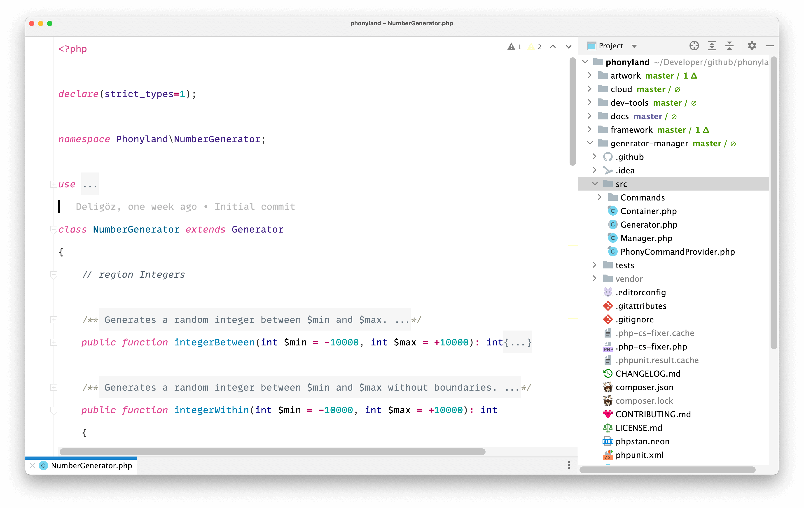
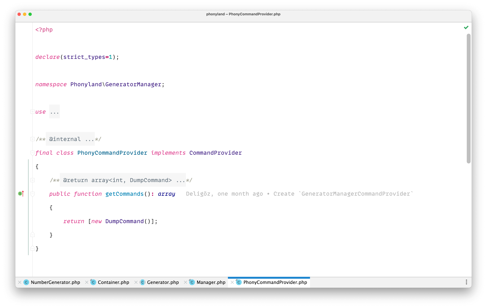
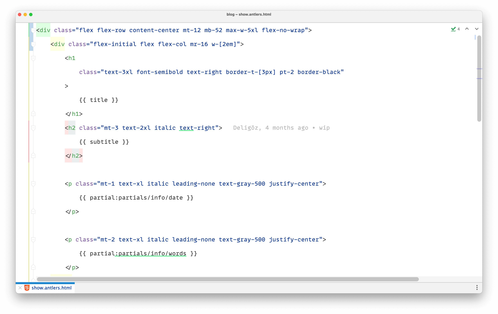
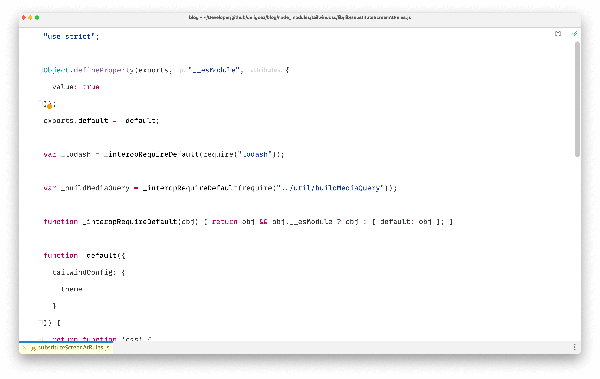
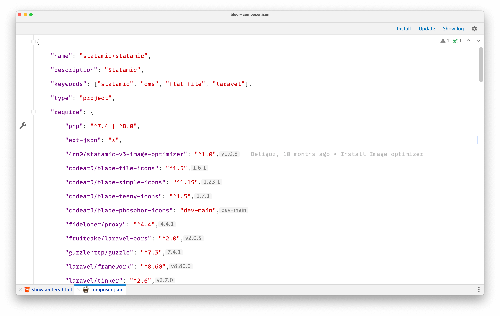
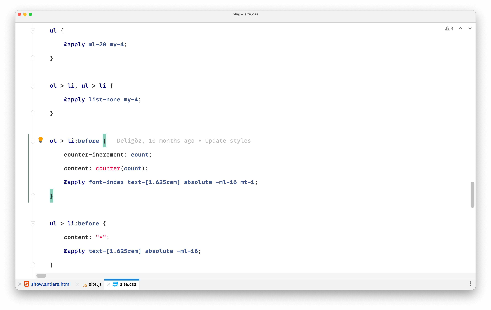
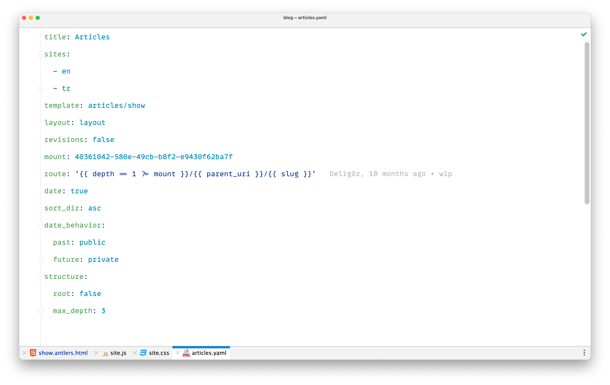

<p align="center">



# Deligoez Theme

</p>

A minimalist color theme family with light and dark variants.

## Supported Editors

| Editor | Light | Dark | Path |
|--------|-------|------|------|
| **Ghostty** | Deligoez Light | Deligoez Dark | `ghostty/` |
| **PHPStorm** | deligoez-light | deligoez-dark | `phpstorm/` |
| **Zed** | Deligoez Light | Deligoez Dark | `zed/` |

## Installation

### Ghostty

```bash
cp ghostty/* ~/.config/ghostty/themes/
```

Then set `theme = Deligoez Light` or `theme = Deligoez Dark` in your Ghostty config.

### PHPStorm

```bash
cp phpstorm/*.icls ~/Library/Application\ Support/JetBrains/PhpStorm*/colors/
```

Then select via `Preferences → Editor → Color Scheme`.

### Zed

```bash
cp zed/deligoez.json ~/.config/zed/themes/
```

Then select via `Cmd+K, Cmd+T` → "Deligoez Light" or "Deligoez Dark".

## Palette

All colors are defined in [`palette.json`](./palette.json) as the single source of truth. All theme files are generated from this palette — never edit them by hand.

The dark variant uses **OKLCH perceptual lightness inversion** — not simple RGB/HSL flipping. This preserves hue identity while ensuring proper contrast on dark backgrounds.

## Generating Themes

After editing `palette.json`, regenerate all theme files:

```bash
python3 generate.py
```

Zero dependencies — pure Python stdlib.

## Fonts

- [Mono Lisa](https://www.monolisa.dev/)

## Screenshots

### PHP


### HTML


### Javascript


### JSON


### CSS


### YAML


## License

[MIT](./LICENSE)
